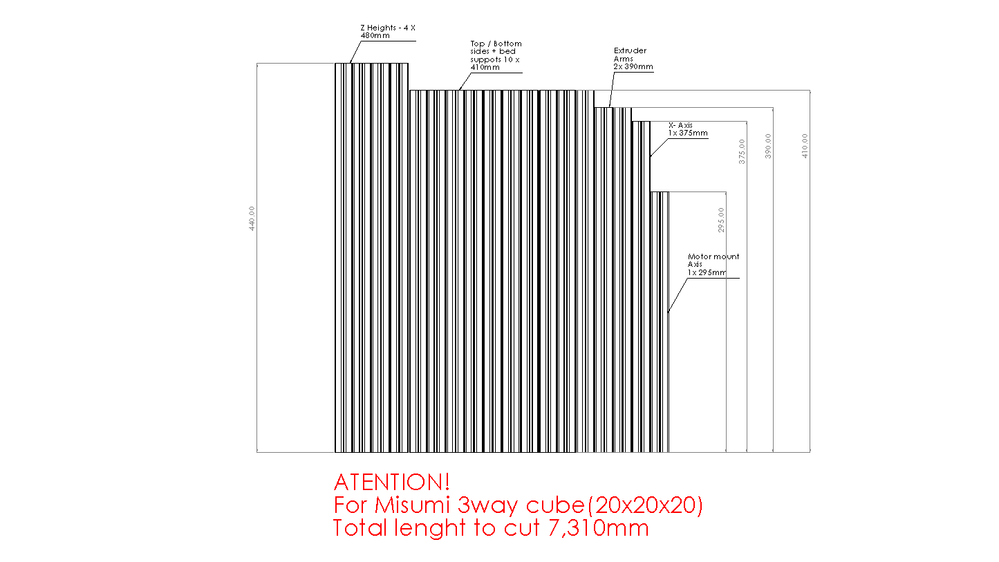

## Frame
  - for 300x300x310 print volume
  - 350mm linear MGN9H rails
  
## Frame General Assembly

## Frame lenghts cut for screw hole 480mm Z heights

## Frame lenghts cut for misumi 3way cube 440mm Z heights

